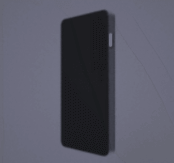

# react-canvas-image-sequence


[](https://www.npmjs.com/package/react-canvas-image-sequence) [](https://standardjs.com)





## Install

```bash
npm install --save react-canvas-image-sequence
```


## Usage

```jsx
import React, { Component } from 'react'

import CanvasImageSequence from 'react-canvas-image-sequence'

class Example extends Component {
  render() {
    return <CanvasImageSequence data={[...]} />
  }
}
```


## Props

|name | desc | type | default |
|---|---|---|---|
| `data` | Image link array | Array | [] |
| `fps` | | Number | 60 |
| `canvasWidth` | | Number | 300 |
| `canvasHeight` | | Number | 300 |
| `autoPlay` |  | Boolean | false |
| `loop` |  | Boolean | false |
| `forward` |  | Boolean | false |
| `onChange` | | Function | null |


## Example

[example](./example)

## License

MIT © [rfw](https://github.com/rfw)
